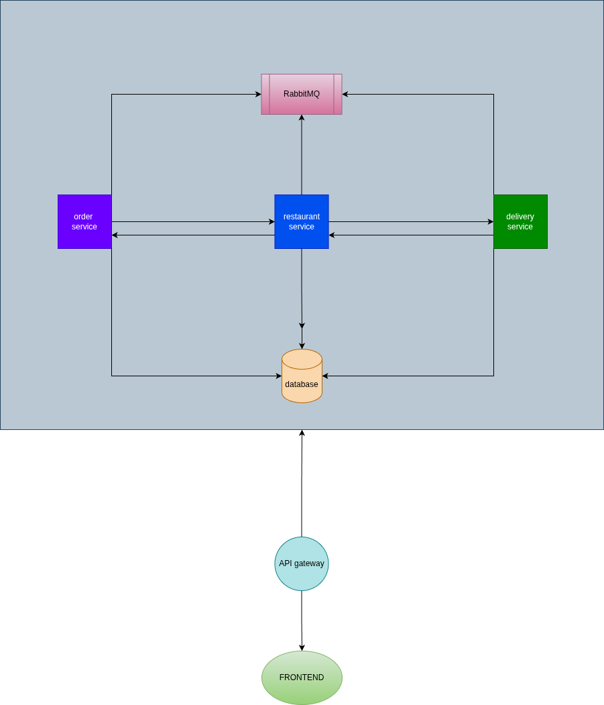

# Food Order Lifecycle System

## Table of Contents
- [System Architecture](#system-architecture)
- [Live Deployment URLs](#live-deployment-urls)
- [API Testing](#api-testing)
- [Assumptions](#assumptions)
- [Tech Stack](#tech-stack)
- [Project Setup](#project-setup)
  - [Prerequisites](#prerequisites)
  - [Local Development Setup](#local-development-setup)
  - [Running with Docker Compose](#4-running-with-docker-compose-recommended)
  - [Running Services Individually](#5-running-services-individually-development)
  - [Production Deployment](#production-deployment)
  - [Troubleshooting](#troubleshooting)

## System Architecture



The system follows a microservices architecture with:
- **Frontend**: Next.js application communicating with the API Gateway
- **API Gateway**: Single entry point routing requests to appropriate microservices
- **Order Service**: Handles order creation and cancellation (in-memory storage)
- **Restaurant Service**: Manages order acceptance and preparation (MongoDB)
- **Delivery Service**: Handles pickup and delivery operations (MongoDB)
- **RabbitMQ**: Message broker for asynchronous communication between services
- **MongoDB**: Database for persisting orders in Restaurant and Delivery services

## Live Deployment URLs

- **Frontend Application**: http://210.79.129.22:7000/
- **Backend API Gateway**: http://210.79.129.22:4000/api
- **API Gateway Status Monitor**: http://210.79.129.22:4000/status
- **Order Service Health**: http://210.79.129.22:4000/api/orders/health
- **Restaurant Service Health**: http://210.79.129.22:4000/api/restaurant/health
- **Delivery Service Health**: http://210.79.129.22:4000/api/delivery/health

## API Testing

A Postman collection is available for testing all API endpoints:
- **Location**: `backend/api-gateway/Food_Order_API.postman_collection.json`
- **Import**: Import this file into Postman to access pre-configured requests for all services
- **Base URL**: The collection is configured for the production API gateway

The collection includes endpoints for:
- Order Management (Create, Cancel, Get Orders)
- Restaurant Operations (Accept, Prepare Orders)
- Delivery Operations (Pickup, Deliver Orders)
- Menu Item Retrieval

## Assumptions

### 1. Mock Data for Users, Restaurants, and Delivery Partners
All user, restaurant, and delivery partner data are mocked and hardcoded in configuration files. Each entity has a predefined role in their respective schema:
- Users have a `customer` role
- Restaurants have a `restaurant` role
- Delivery partners have a `delivery_partner` role

In a production environment, these would be stored in a proper user management database with complete profile information.

### 2. Simplified RBAC Implementation
The current RBAC (Role-Based Access Control) implementation works by identifying users through `userId`, `restaurantId`, or `driverId` from the mocked data. In a real-world scenario, this would be implemented using:
- OAuth 2.0 / OpenID Connect for authentication
- DPoP (Demonstrating Proof-of-Possession) mechanism for secure token usage
- JWT tokens with proper signature verification
- Session management and token refresh mechanisms
- Proper authorization headers and middleware

### 3. Limited Database Persistence
Only orders and their status are persisted in the database (MongoDB). Other data including:
- Menu items (hardcoded in configuration)
- User information (hardcoded in configuration)
- Restaurant details (hardcoded in configuration)
- Delivery partner information (hardcoded in configuration)

In a production system, all entities would be properly stored and managed in the database.

### 4. No Authentication Layer
The system does not implement actual authentication mechanisms:
- No login/logout functionality
- No password hashing or verification
- No session management
- No token-based authentication
- Users are automatically "logged in" based on hardcoded IDs

### 5. Polling Instead of Real-Time Updates
WebSocket connections are intentionally avoided. Instead, the frontend uses TanStack Query (React Query) with manual refetch and query invalidation for data updates:
- Refresh buttons trigger data refetching
- No real-time push notifications
- No live order status updates
- Users must manually refresh to see changes

In a production environment, WebSocket or Server-Sent Events (SSE) would provide real-time updates for better user experience.

### 6. In-Memory Storage for Order Service
The Order Service uses an in-memory Map data structure for storing orders instead of a database. This means:
- Order data is lost when the service restarts
- No data persistence for the Order Service
- Not suitable for production use

### 7. Static Menu Items
Restaurant menu items are statically defined in configuration files and shared across all services. There is no:
- Dynamic menu management
- Menu item CRUD operations
- Price updates
- Availability management

### 8. Single Restaurant and Single User Simulation
The simulator frontend is designed to work with predefined default users, restaurants, and delivery partners:
- Default user ID is hardcoded
- Default restaurant ID is hardcoded
- Default delivery partner ID is hardcoded
- No ability to switch between multiple users/restaurants/drivers dynamically

### 9. Simplified Error Handling
Error handling is basic and primarily uses console logging and simple error messages. Production systems would require:
- Comprehensive error logging
- Error tracking services (e.g., Sentry)
- Detailed error codes
- User-friendly error messages
- Retry mechanisms

### 10. Technology Stack Deviation
The backend is implemented using Node.js/Express instead of Spring Boot as specified in the original requirements. This was done for:
- Faster development time
- Simplified microservices communication
- Better integration with the JavaScript ecosystem

### 11. Environment Variables Exposed
The `.env` file and environment variables are intentionally made public in the repository for demonstration purposes. This includes:
- MongoDB connection strings
- RabbitMQ credentials
- API keys and secrets

**Important**: All credentials and database instances will be destroyed immediately after the assignment evaluation. In a production environment, sensitive credentials should:
- Never be committed to version control
- Use `.gitignore` to exclude `.env` files
- Be stored in secure secret management systems (AWS Secrets Manager, HashiCorp Vault, etc.)
- Use environment-specific configurations

## Tech Stack

### Backend Services
- **Runtime**: Node.js (v18+)
- **Framework**: Express.js
- **Language**: JavaScript (ES6+ with modules)
- **Database**: MongoDB (for Restaurant and Delivery services)
- **Message Queue**: RabbitMQ (for asynchronous inter-service communication)
- **API Architecture**: RESTful APIs with microservices pattern

### Backend Service Components

#### 1. Order Service (Port 3001)
- Handles order creation and cancellation
- In-memory storage using Map
- Publishes events to RabbitMQ
- RBAC middleware for customer role

#### 2. Restaurant Service (Port 3002)
- Manages order acceptance and preparation
- MongoDB for order persistence
- Consumes RabbitMQ messages
- RBAC middleware for restaurant role

#### 3. Delivery Service (Port 3003)
- Handles pickup and delivery operations
- MongoDB for delivery persistence
- Consumes RabbitMQ messages
- RBAC middleware for delivery partner role

#### 4. API Gateway (Port 4000)
- Centralized entry point for all client requests
- HTTP proxy using http-proxy-middleware
- Routes requests to appropriate microservices
- CORS enabled for frontend communication

### Frontend
- **Framework**: Next.js 14+ (React)
- **Language**: JavaScript (JSX)
- **UI Library**: Tailwind CSS with shadcn/ui components
- **State Management**: TanStack Query (React Query) for server state
- **HTTP Client**: Axios with interceptors
- **Routing**: Next.js App Router

### Infrastructure & DevOps
- **Containerization**: Docker with multi-stage builds
- **Orchestration**: Docker Compose
- **Health Checks**: Express status monitor and custom health endpoints
- **Networking**: Docker bridge network for service communication

### Key Dependencies

#### Backend
- `express` - Web framework
- `mongoose` - MongoDB ODM
- `amqplib` - RabbitMQ client
- `cors` - CORS middleware
- `uuid` - Unique ID generation
- `express-status-monitor` - Service health monitoring
- `http-proxy-middleware` - API Gateway proxy

#### Frontend
- `next` - React framework
- `react` & `react-dom` - UI library
- `@tanstack/react-query` - Data fetching and caching
- `axios` - HTTP client
- `tailwindcss` - Utility-first CSS
- `lucide-react` - Icon library
- `shadcn/ui` - UI component library

### Development Tools
- **Process Manager**: PM2 (for production)
- **Environment Variables**: dotenv
- **API Testing**: Postman collection included

## Project Setup

### Prerequisites
- Node.js (v18 or higher)
- pnpm (v8 or higher)
- Docker and Docker Compose
- MongoDB Atlas account (for cloud database) or local MongoDB
- Git

### Local Development Setup

#### 1. Clone the Repository
```bash
git clone https://github.com/a-s-t-e-y-a/assigment-lets-try.git
cd assigment-lets-try
```

#### 2. Environment Configuration
Create `.env` file in the root directory:
```env
MONGODB_URI_RESTAURANT=your_mongodb_connection_string_for_restaurant
MONGODB_URI_DELIVERY=your_mongodb_connection_string_for_delivery
```

#### 3. Install Dependencies

**Backend Services:**
```bash
cd backend/order-service
pnpm install

cd ../restaurant-service
pnpm install

cd ../delivery-service
pnpm install

cd ../api-gateway
pnpm install
```

**Frontend:**
```bash
cd ../../frontend
pnpm install
```

#### 4. Running with Docker Compose (Recommended)

**Start all services:**
```bash
docker-compose up --build
```

This will start:
- RabbitMQ (with management UI on port 15672)
- Order Service (Port 3001)
- Restaurant Service (Port 3002)
- Delivery Service (Port 3003)
- API Gateway (Port 4000)
- Frontend (Port 7000)

**Stop all services:**
```bash
docker-compose down
```

#### 5. Running Services Individually (Development)

**Terminal 1 - Start RabbitMQ:**
```bash
docker run -d --name rabbitmq -p 5672:5672 -p 15672:15672 \
  -e RABBITMQ_DEFAULT_USER=myuser \
  -e RABBITMQ_DEFAULT_PASS=mypass \
  rabbitmq:3-management
```

**Terminal 2 - Order Service:**
```bash
cd backend/order-service
pnpm run dev
```

**Terminal 3 - Restaurant Service:**
```bash
cd backend/restaurant-service
pnpm run dev
```

**Terminal 4 - Delivery Service:**
```bash
cd backend/delivery-service
pnpm run dev
```

**Terminal 5 - API Gateway:**
```bash
cd backend/api-gateway
pnpm run dev
```

**Terminal 6 - Frontend:**
```bash
cd frontend
pnpm run dev
```

#### 6. Access the Application

- **Frontend**: http://localhost:7000
- **API Gateway**: http://localhost:4000/api
- **Status Monitor**: http://localhost:4000/status
- **RabbitMQ Management**: http://localhost:15672 (username: myuser, password: mypass)

### Docker Build Only

To build Docker images without running:

```bash
docker-compose build
```

### Production Deployment

#### 1. Update Environment Variables
Update `.env` file with production MongoDB URIs and set:
```env
NODE_ENV=production
```

#### 2. Build and Deploy
```bash
docker-compose -f docker-compose.yml up -d --build
```

#### 3. Check Service Health
```bash
curl http://your-server:4000/api/orders/health
curl http://your-server:4000/api/restaurant/health
curl http://your-server:4000/api/delivery/health
```

### Testing with Postman

1. Import the Postman collection from `backend/api-gateway/Food_Order_API.postman_collection.json`
2. Update the base URL to your deployment URL
3. Test all endpoints for Order, Restaurant, and Delivery operations

### Troubleshooting

**RabbitMQ Connection Issues:**
- Ensure RabbitMQ is running: `docker ps | grep rabbitmq`
- Check connection string in services
- Wait for RabbitMQ to fully start (may take 30-60 seconds)

**MongoDB Connection Issues:**
- Verify MongoDB URI is correct in `.env`
- Check network connectivity to MongoDB Atlas
- Ensure IP whitelist is configured in MongoDB Atlas

**Port Already in Use:**
```bash
# Find process using port
lsof -i :4000
# Kill process
kill -9 <PID>
```

**Docker Issues:**
```bash
# Clean up all containers and volumes
docker-compose down -v
docker system prune -a

# Rebuild from scratch
docker-compose up --build --force-recreate
```